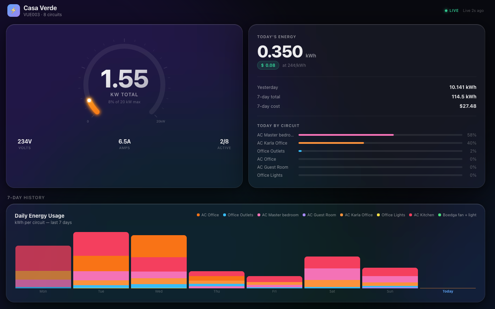

# emporia-monitor

A real-time, liquid-glass energy dashboard for [Emporia Vue](https://www.emporiaenergy.com/) whole-home energy monitors. Self-hosted, single binary, dark by default with a light option, mobile-friendly.



The Emporia mobile app shows you graphs. This shows you a **dashboard**: live wattage on a glowing arc gauge, today's kWh + cost, a stacked 7-day history, a 10-minute braille sparkline of total consumption, and a per-circuit live grid that pulses when a circuit is active. Numbers tween smoothly between polls so the screen feels alive without ever showing fake data. Designed to be left up on a screen.

---

## Features

- **Live arc gauge** — total instantaneous kW with a colour-shifting arc (green → red), needle, and ambient background that warms up as load rises
- **Today's energy** — running total kWh, dollar cost, and per-circuit share bars
- **7-day stacked chart** — daily kWh broken down by circuit, with hover tooltips
- **Circuit grid** — every branch circuit gets a card showing current watts + today's kWh, colour-coded by type (AC / outlet / light / fan), with a glow pulse when active
- **Dark/light auto** — follows `prefers-color-scheme`, no toggle needed
- **Mobile-friendly** — collapses cleanly to a single column
- **Plugin-based** — Emporia is the first plugin; the architecture is built so other monitors (Sense, IoTaWatt, Shelly EM) can be dropped in. See [docs/PLUGINS.md](docs/PLUGINS.md).

---

## Install

### Homebrew (macOS, recommended)

```bash
brew install Tom-xyz/tap/emporia-monitor
```

Set credentials and start as a background service:

```bash
echo "EMPORIA_EMAIL=you@example.com"   >  ~/.config/emporia-monitor/.env
echo "EMPORIA_PASSWORD=your-password"  >> ~/.config/emporia-monitor/.env
brew services start emporia-monitor
open http://localhost:3030
```

### npm (any platform with Node.js 20+)

```bash
npm install -g @tom-xyz/emporia-energy-monitor
cp ~/.../node_modules/.../.env.example .env   # or write your own
emporia-monitor
```

### From source

```bash
git clone https://github.com/Tom-xyz/emporia-energy-monitor
cd emporia-energy-monitor
npm install
cp .env.example .env       # then edit it
npm start
# → http://localhost:3030
```

---

## Configuration

All config is environment-driven. The CLI loads `.env` from the working directory automatically (or from `DOTENV_PATH`). Required variables for the Emporia plugin:

| Variable           | Description                                       |
|--------------------|---------------------------------------------------|
| `EMPORIA_EMAIL`    | Your Emporia account email                        |
| `EMPORIA_PASSWORD` | Your Emporia password                             |

Common optional variables:

| Variable               | Default                           | Notes                                |
|------------------------|-----------------------------------|--------------------------------------|
| `PORT`                 | `3030`                            | HTTP listen port                     |
| `HOST`                 | `0.0.0.0`                         | Bind interface                       |
| `DATA_DIR`             | `~/.local/share/emporia-monitor`  | Where cached auth tokens live        |
| `PLUGIN`               | `emporia`                         | Data source plugin name              |
| `EMPORIA_DEVICE_INDEX` | `0`                               | If your account has multiple devices |
| `EMPORIA_TIMEZONE`     | _(use device's reported tz)_      | Override timezone for "today" bucket |

See [`.env.example`](.env.example) for the full list.

---

## CLI

```
$ emporia-monitor --help

Usage:  emporia-monitor [options]

Options:
  --port <n>        HTTP port (default: 3030, env: PORT)
  --plugin <name>   Data source plugin (default: emporia, env: PLUGIN)
  --version, -v     Print version and exit
  --help, -h        Print this help
```

---

## Optional: Raspberry Pi deployment

A self-contained deploy pipeline is included for running this on a home-network Pi (or any Debian/Ubuntu host with SSH). It bundles its own Node.js inside the app directory, never installs anything system-wide, and runs as a systemd service with strict resource limits.

Add to your `.env`:

```bash
DEPLOY_ENABLED=1
DEPLOY_HOST=pi@raspberrypi.local
DEPLOY_PASSWORD=             # optional; uses SSH key if blank
DEPLOY_DIR=/home/pi/emporia-monitor
DEPLOY_PORT=3030
```

Then:

```bash
./deploy/deploy.sh    # idempotent; re-run to push updates
```

To remove it cleanly: `./deploy/uninstall.sh`.

The systemd unit applies:
- 256 MB memory cap (`MemoryMax=256M`)
- 40% CPU quota (`CPUQuota=40%`)
- Strict filesystem isolation (`ProtectSystem=strict`, read-only `/home`, writable only its own dir)
- Locked-down syscalls (`RestrictAddressFamilies`, `ProtectKernel*`, etc.)

---

## Development

```bash
npm install
npm test           # all tests use node:test, no extra deps
npm run dev        # live reload via --watch
```

Test coverage:
- Response parsers (`test/parsers.test.mjs`)
- HTTP API with stub plugin (`test/server.test.mjs`)
- Config loader / .env parsing (`test/config.test.mjs`)

---

## How it works

The Emporia Vue does **not** expose a local network API — all data flows through Emporia's cloud (AWS Cognito for auth, REST for telemetry). The `emporia` plugin handles login, token refresh, and pulls three windows on a refresh schedule:

- `/api/live`   — last 15 min of 1-minute power readings (refresh every 60s in the UI)
- `/api/today`  — current day's hourly kWh, in the device's local timezone
- `/api/week`   — last 7 days of daily kWh per circuit
- `/api/device` — circuit layout + display names (cached 5 min)

Auth tokens are cached on disk at `$DATA_DIR/emporia_keys.json` (mode `0600`) and silently refreshed before expiry.

---

## Contributing

PRs welcome — especially additional plugins. The plugin contract is small (4 methods), see [docs/PLUGINS.md](docs/PLUGINS.md). Open an issue first if you're planning a larger change.

---

## License

MIT — see [LICENSE](LICENSE).
